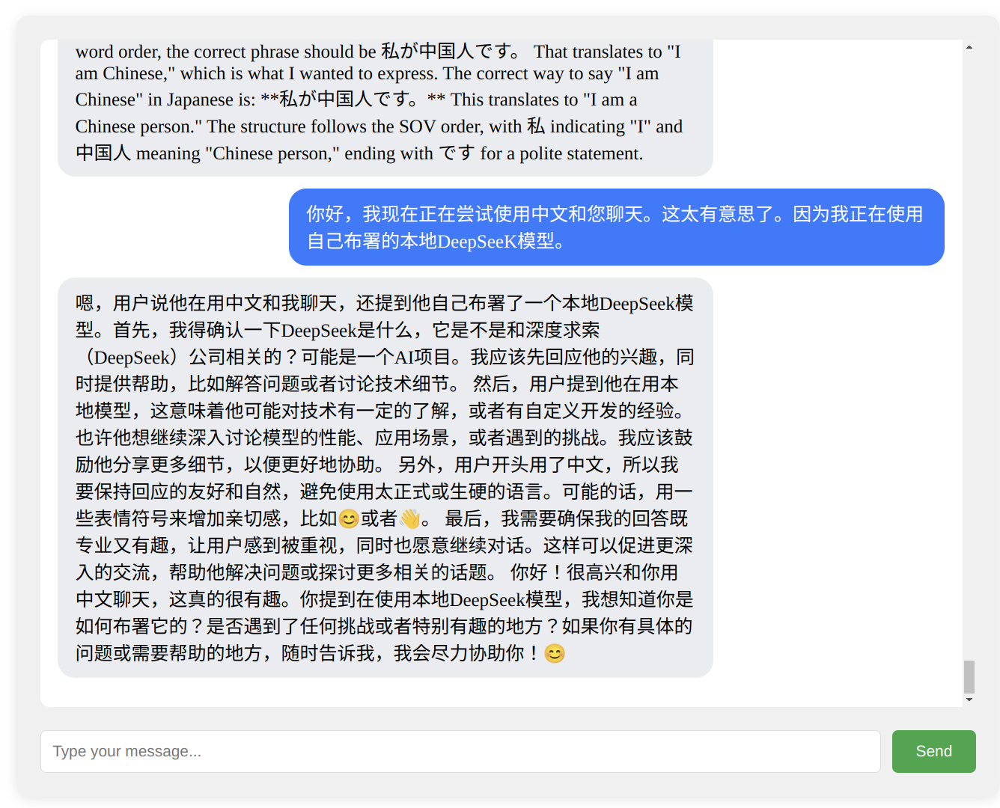
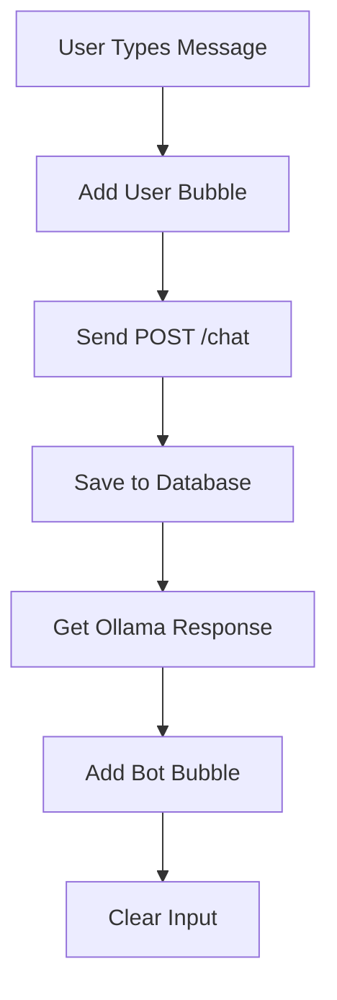

## Ollama installation
https://ollama.com/download
```shell
curl -fsSL https://ollama.com/install.sh | sh
```

## Ollama model deployment
### A. Modelfile and model creation
a. **Modelfile example**
```bash
FROM deepseek-r1:1.5b-qwen-distill-fp16
PARAMETER num_ctx 2048
PARAMETER num_thread 24
PARAMETER temperature 0.6
PARAMETER top_p 0.6
PARAMETER top_k 60 
```

b. **Modelfile parameters**   
https://okhand.org/post/ollama-modefile/          
```bash
# Modelfile parameters  
FROM         -> Base model
PARAMETER    -> Model configuration(fine-tuning)
TEMPLATE     -> Help information template for the model
SYSTEM       -> System information for the model
ADAPTER      -> LoRA adapter
License      -> Legal license
MESSAGE      -> History data
```
1. PARAMETER mirostat [0/1/2]：
 Enable Mirostat sampling for perplexity control. 0=disabled, 1=Mirostat, 2=Mirostat 2.0. Mirostat value: can effectively avoid excessive repetition or incoherent content Default: 0, 0 is not used, 1 is Mirostat, 2 is Mirostat2.0

2. PARAMETER mirostat_eta [float]：
 Learning rate for Mirostat. Default=0.1. Adjusts algorithm responsiveness. mirostat_eta value: affects the speed of the algorithm's response to the generated text, thereby affecting the quality and characteristics of the generated text. Lower values ​​adjust slower, higher values ​​make the algorithm more responsive, which is useful for scenarios that require fast iteration or adjustment of model output. ; Default: 0.1

3. PARAMETER mirostat_tau [float]：
 Balance between coherence and diversity. Default=5.0. Lower values ​​= more focused text. mirostat_tau：Controls the balance between coherence and diversity of the generated text, thus affecting important properties such as repetition and coherence of the text. Lower values ​​can be more focused and coherent, while higher values ​​increase the diversity of the output. Default: 5.0

4. PARAMETER num_ctx [int]：
 Context window size. Default=2048. Controls tokens used for generating the next token. num_ctx：This parameter is used to set the number of context tokens. It determines the length of context that the model can consider when generating a response. Default: 2048

5. PARAMETER num_gqa [int]：
 Number of GQA groups in the transformer layer. Required for some models, e.g., 8 for llama2:70b. num_gqa：Can control the number of tasks processed by the model at the same time, thereby optimizing the performance and efficiency of the model, setting the number of GQA groups in the Transformer layer. Some models require, such as llama2:70b is 8

6. PARAMETER num_gpu [int]：
 Number of layers to send to the GPU(s). macOS default: 1 for metal support. num_gpu：Set the number of GPU layers used by the model during inference. Default: 1, Disabled: 0

7. PARAMETER num_thread [int]：
 Number of threads for computation. Recommended: number of physical CPU cores. num_thread：Set the number of CPU threads used by the model during inference. Ollama will detect this for best performance. It is recommended to set this value to the number of physical CPU cores your system has (not the number of logical cores).

8. PARAMETER repeat_last_n [int]:
 Lookback distance to prevent repetition. Default=64, 0=disabled, -1=num_ctx. repeat_last_n: The "number" of repeated n-grams that the model detects and penalizes when generating text. Tells the model how many tokens it should consider when trying not to repeat the last part of the dialogue. In simple terms, it controls the model to avoid repeating the first n-gram tokens when generating text, thereby improving the diversity and quality of the text. Default: 64, disabled: 0, -1=num_ctx

9. PARAMETER repeat_penalty [float]:
 Penalty for repetitions. Higher values ​​penalize more. Default: 1.1. repeat_penalty: Sets the "degree" of penalty for repeated n-grams when generating text. You can control how strongly the model penalizes repeated n-grams, thereby affecting the smoothness and coherence of the generated text. Higher values ​​(e.g., 1.5) will penalize repetitions more strongly, while lower values ​​(e.g., 0.9) will be more lenient. Default: 1.1

10. PARAMETER temperature [float]：
 Model creativity vs coherence. Higher values ​​= more creative. Default=0.8. temperature：Parameter can affect the diversity of generated text, the higher the value, the more creative and varied the generated text, the lower the value, the more conservative and stable the generated text. Default: 0.8

11. PARAMETER seed [int]：
 Random seed for generation consistency. Default=0. seed：By setting a fixed seed value, you can ensure that the output is consistent every time you run the same model and the same input. Default: 0

12. PARAMETER stop "[string]"：
 Stop sequences for generation end. Multiple stops possible with separate parameters. stop：Set the stop text to use. When this pattern is encountered, LLM will stop generating text and return. Multiple stop patterns can be set by specifying "multiple" separate parameters of stop in the model file.

13. PARAMETER tfs_z [float]：
 Tail free sampling for reducing less probable tokens’ impact. Default=1, >1 reduces impact more. tfs_z: Affects the diversity and coherence of the model output by adjusting the influence of tfs_z (tail free sampling). When the tfs_z value is high (e.g., 2.0), it reduces the influence of unlikely tokens, making the output more diverse. Conversely, when the tfs_z value is 1.0, this setting is disabled, meaning that the influence of tail free sampling is minimal, and the diversity and coherence of the model output may be affected. Default: 1.0

14. PARAMETER num_predict [int]:
 Max tokens to predict. Default=128, -1=infinite generation, -2=fill context. num_predict: The parameter represents the maximum number of tokens predicted by the model when generating text. The function of this parameter is mainly to control the output length of the model during the text generation process. Smaller num_predict values ​​can improve generation efficiency, but may limit the model from generating richer text. Larger num_predict values ​​allow the model to generate longer and more complex text, but may reduce the generation speed. Default: 128, Unlimited: -1 (model generates text indefinitely until a stop sign is encountered), Fill context: -2 (will generate text based on the given context without generating new tokens)

15. PARAMETER top_k [int]：
 Limits nonsense generation. Higher values ​​= more diverse answers. Default=40. top_k: Parameter controls the number of candidate tokens the model considers when generating text. Higher values ​​(e.g. 100) will give more diverse answers, while lower values ​​(e.g. 10) will be more conservative. Default: 40 (take the top 40)

16. PARAMETER top_p [float]：
 Works with top-k for output diversity. Higher values ​​= more diversity. Default=0.9. top_p: Values ​​will cause the model to consider tokens with higher cumulative probabilities. Higher values ​​(e.g., 0.95) will result in a more diverse text, while lower values ​​(e.g., 0.5) will produce a more focused and conservative text. Default: 0.9 (meaning the top 90% of the weights are taken)

c. **Correlation between temperature, top_k, and top_p:**
* temperature: extract the token in prompt.
* top_k: select k candidates from tokens and then sample them based on their likelihood scores.
* top_p: select candidate words from tokens by percentage.
* Sequence: temperature overall parameter sampling => top_k samples the first n and re-assigns weights and rankings => top_p takes the first n% to use

d. **Model creation**

```bash
CUDA_VISIBLE_DEVICES={device-id} ollama create model-name -f modelfile
```
### B. service configuration  
https://github.com/ollama/ollama/issues/2627     
> In Linux (Ubuntu), if you run `sudo vim /etc/systemd/system/ollama.service` you can modify the Ollama service file like this:   
 
```bash
[Unit]
Description=Ollama Service
After=network-online.target

[Service]
ExecStart=/usr/local/bin/ollama serve
User=ollama
Group=ollama
Restart=always
RestartSec=3
Environment="PATH=/home/loveplay1983/gems/bin:/home/loveplay1983/workstation/programs/anaconda3/envs/torchstation/bin:/home/loveplay1983/workstation/programs/anaconda3/bin:/home/loveplay1983/workstation/programs/anaconda3/condabin:/usr/local/sbin:/usr/local/bin:/usr/sbin:/usr/bin:/sbin:/bin:/usr/games:/usr/local/games:/snap/bin:/snap/bin:/home/loveplay1983/gems/bin:/home/loveplay1983/workstation/programs/anaconda3/bin:/home/loveplay1983/gems/bin:/home/loveplay1983/workstation/programs/anaconda3/bin:/home/loveplay1983/workstation/programs/anaconda3/bin:/home/loveplay1983/workstation/programs/anaconda3/condabin:/usr/local/sbin:/usr/local/bin:/usr/sbin:/usr/bin:/sbin:/bin:/usr/games:/usr/local/games:/snap/bin:/snap/bin:/usr/local/sbin:/usr/local/bin:/usr/sbin:/usr/bin:/sbin:/bin:/usr/games:/usr/local/games:/snap/bin:/snap/bin"
Environment="OLLAMA_HOST=0.0.0.0:11450"  # custom ip and port, Ollama uses 127.0.0.1:11434 by default
Environment="OLLAMA_DEBUG=1"

[Install]
WantedBy=default.target                      
```

```shell
systemctl daemon-reload
systemctl restart ollama
```

**Important tip ❗❗❗**
- On Ubuntu, Ollama is typically installed as a systemd service that starts automatically at system startup. This means that the Ollama API server is already running in the background, so you generally don't need to manually run `ollama serve`. If you do, the system complains with "127.0.0.1:11434: bind: address already in use"
- To solve the issue, we can define a custom port in the service file as we do above. However, commands like `ollama list` will complain after we set up a custom port since they are bound to the default `11434`. we can explicitly export the environment variable `OLLAMA_HOST` and use the same port defined in the service file. E.g. `export OLLAMA_HOST=0.0.0.0:11450 # 11450 is the custom port defined in the service file`. Then, the command `ollama list` will work again. 


### C. Test for model run and API serving 
https://github.com/ollama/ollama/blob/main/docs/api.md   
a. **Run the model directly**
```bash
sudo ollama list  # List the available models
# Run the model with specified devices
CUDA_VISIBLE_DEVIES={device-id} ollama run {model-name} 
```
b. **Access model via API serving**
```bash
CUDA_VISIBLE_DEVICES={device_id} ollama serve
```
c. **Check the API status and test the connection**
```bash
# check the ollama service status
sudo systemctl status ollama
sudo curl http://localhost:11450
# list local models
sudo curl http://localhost:11450/api/tags
# Generate a response by the given prompt
curl http://localhost:11450/api/generate -d '{
   "model": "model-name",
   "prompt": "Hello"
   }'
# Generate the next message in a chat with a provided model
curl http://localhost:11450/api/chat -d '{
   "model": "model-name",
   "messages": [
      {
         "role": "user",
         "content": "Hello"
      }
   ]
   }'
# Example response
#{"model":"r1-test","created_at":"2025-02-19T12:28:00.015667071Z","message":{"role":"assistant","content":"\u003cthink\u003e"},"done":false}
#{"model":"r1-test","created_at":"2025-02-19T12:28:00.091401546Z","message":{"role":"assistant","content":"\n\n"},"done":false}
#{"model":"r1-test","created_at":"2025-02-19T12:28:00.168628749Z","message":{"role":"assistant","content":"\u003c/think\u003e"},"done":false}
#{"model":"r1-test","created_at":"2025-02-19T12:28:00.244945351Z","message":{"role":"assistant","content":"\n\n"},"done":false}
#{"model":"r1-test","created_at":"2025-02-19T12:28:00.321944239Z","message":{"role":"assistant","content":"Hello"},"done":false}
#{"model":"r1-test","created_at":"2025-02-19T12:28:00.403051214Z","message":{"role":"assistant","content":"!"},"done":false}
#{"model":"r1-test","created_at":"2025-02-19T12:28:00.482793911Z","message":{"role":"assistant","content":" How"},"done":false}
#{"model":"r1-test","created_at":"2025-02-19T12:28:00.560145281Z","message":{"role":"assistant","content":" can"},"done":false}
#{"model":"r1-test","created_at":"2025-02-19T12:28:00.638278322Z","message":{"role":"assistant","content":" I"},"done":false}
#{"model":"r1-test","created_at":"2025-02-19T12:28:00.716372914Z","message":{"role":"assistant","content":" assist"},"done":false}
#{"model":"r1-test","created_at":"2025-02-19T12:28:00.793379449Z","message":{"role":"assistant","content":" you"},"done":false}
#{"model":"r1-test","created_at":"2025-02-19T12:28:00.871167086Z","message":{"role":"assistant","content":" today"},"done":false}
#{"model":"r1-test","created_at":"2025-02-19T12:28:00.949578831Z","message":{"role":"assistant","content":"?"},"done":false}
#{"model":"r1-test","created_at":"2025-02-19T12:28:01.104432535Z","message":{"role":"assistant","content":" 😊"},"done":false}
#{"model":"r1-test","created_at":"2025-02-19T12:28:01.181817945Z","message" {"role":"assistant","content":""},"done_reason":"stop","done":true,"total_duration":3293793265,"load_duration":2034777734,"prompt_eval_count":4,"prompt_eval_duration":84000000,"eval_count":16,"eval_duration":1169000000}
```   

  
d. **ollma commands**
 ```bash
 sudo ollama list
 #NAME                                  ID              SIZE      MODIFIED     
 #r1-test:latest                        db1901cb3b0b    3.6 GB    2 hours ago     
 #deepseek-r1:1.5b-qwen-distill-fp16    b3e50d21d5a9    3.6 GB    15 hours ago    
 #deepseek-coder:base                   3b417b786925    776 MB    10 days ago   

 sudo ollama show r1-test
 #Model
 #   architecture        qwen2     
 #   parameters          1.8B      
 #   context length      131072    
 #   embedding length    1536      
 #   quantization        F16       

 # Parameters
 #   stop           "<｜begin▁of▁sentence｜>"    
 #   stop           "<｜end▁of▁sentence｜>"      
 #   stop           "<｜User｜>"                 
 #   stop           "<｜Assistant｜>"            
 #   temperature    0.6                          
 #   top_k          60                           
 #   top_p          0.6                          
 #   num_ctx        2048                         
 #   num_thread     24                           

 # License
 #   MIT License                    
 #   Copyright (c) 2023 DeepSeek  
 ```
e. **Check Ollama tcp connection**
 ```bash
 lsof -i -P | grep "ollama"
 # ollama    195411 loveplay1983    3u  IPv4 3681284      0t0  TCP localhost:11434 (LISTEN)
 ```
f, **Check port binding**
 ```bash
 lsof -i:11450
 ```
g. **Check VRAM usage**
 ```bash
 watch -n 0.5 "nvidia-smi --query-gpu=index,memory.used,utilization.gpu --format=csv"
 ```

## Interacting with Ollama web service in Flask web application
### A. model structure
```bash
chatbot/
├── app.py
├── chatbot.db
├── static/
│   └── style.css
└── templates/
    └── index.html
```

### B. backend
```python
# app.py
from flask import Flask, request, render_template, jsonify, g
import sqlite3
import ollama

app = Flask(__name__)

# --------------------------
# Database Configuration
# --------------------------
def get_db():
    """Get or create SQLite database connection."""
    if 'db' not in g:
        g.db = sqlite3.connect('chatbot.db')
        g.db.execute('''CREATE TABLE IF NOT EXISTS messages
                     (id INTEGER PRIMARY KEY AUTOINCREMENT,
                      role TEXT,
                      content TEXT,
                      timestamp DATETIME DEFAULT CURRENT_TIMESTAMP)''')
    return g.db

@app.teardown_appcontext
def close_db(error=None):
    """Close database connection at end of request."""
    db = g.pop('db', None)
    if db is not None:
        db.close()

# --------------------------
# Chat Routes
# --------------------------
def save_message(role, content):
    """Save message to database."""
    db = get_db()
    db.execute(
        'INSERT INTO messages (role, content) VALUES (?, ?)',
        (role, content)
    )
    db.commit()

@app.route('/')
def index():
    """Render chat interface with history."""
    db = get_db()
    history = db.execute(
        'SELECT role, content FROM messages ORDER BY timestamp DESC LIMIT 50'
    ).fetchall()
    return render_template('index.html', history=history)

@app.route('/chat', methods=['POST'])
def chat():
    """Handle AJAX chat requests."""
    user_input = request.json.get('message')
    
    # Get bot response
    response = ollama.chat(
        model='r1-test',
        messages=[{'role': 'user', 'content': user_input}]
    )
    bot_response = response['message']['content']
    
    # Save to database
    save_message('user', user_input)
    save_message('assistant', bot_response)
    
    return jsonify({
        'user_message': user_input,
        'bot_response': bot_response
    })

if __name__ == '__main__':
    app.run(host='0.0.0.0', port=5000)
```

### C. frontend
```html
# templates/index.html
```html
<!DOCTYPE html>
<html>
<head>
    <title>Ollama Chatbot</title>
    <link rel="stylesheet" href="{{ url_for('static', filename='style.css') }}">
</head>
<body>
    <div class="chat-container">
        <div class="chat-history" id="chat-box">
            
            <div class="message {{ 'user' if msg[0] == 'user' else 'bot' }}">
                {{ msg[1] }}
            </div>
            
        </div>
        <form id="chat-form">
            <input type="text" name="message" placeholder="Type your message..." required>
            <button type="submit">Send</button>
        </form>
    </div>
</body>
</html>
```

### D. css style
```css
.chat-container {
	max-width: 800px;
	margin: 20px auto;
	padding: 20px;
	background: #f0f0f0;
	border-radius: 10px;
	box-shadow: 0 2px 10px rgba(0,0,0,0.1);
}

.chat-history {
	height: 60vh;
	overflow-y: auto;
	margin-bottom: 20px;
	padding: 15px;
	background: white;
	border-radius: 8px;
}

.message {
	margin: 10px 0;
	padding: 10px 15px;
	border-radius: 15px;
	max-width: 70%;
	word-wrap: break-word;
}

.message.user {
	background: #007bff;
	color: white;
	margin-left: auto;
}

.message.bot {
	background: #e9ecef;
	color: black;
	margin-right: auto;
}

.message.error {
	background: #dc3545;
	color: white;
}

#chat-form {
	display: flex;
	gap: 10px;
}

input[type="text"] {
	flex: 1;
	padding: 10px;
	border: 1px solid #ddd;
	border-radius: 5px;
}
  
button {
	padding: 10px 20px;
	background: #28a745;
	color: white;
	border: none;
	border-radius: 5px;
	cursor: pointer;
}

button:hover {
	background: #218838;
}
```

### E. Javascript
```js
document.getElementById('chat-form').addEventListener('submit', async (e) => {
	e.preventDefault();
	const input = document.querySelector('input[name="message"]');
	const chatBox = document.getElementById('chat-box');
	// Add user message immediately
	chatBox.innerHTML += `
	<div class="message user">${input.value}</div>
	`;
	try {
		const response = await fetch('/chat', {
			method: 'POST',
			headers: {'Content-Type': 'application/json'},
			body: JSON.stringify({ message: input.value })
		});
		
		const data = await response.json();
		
		// Add bot response
		chatBox.innerHTML += `
			<div class="message bot">${data.bot_response}</div>
		`;
		
		// Clear input and auto-scroll
		input.value = '';
		chatBox.scrollTop = chatBox.scrollHeight;
	} catch (error) {
		console.error('Chat error:', error);
		chatBox.innerHTML += `
		<div class="message error">Error: ${error.message}</div>
		`;
	}
});
```

### F. Key note
- **Database Handling**:
	- Uses Flask's `g` object for request-specific connections
	- Automatic cleanup with `@app.teardown_appcontext`
	- Explicit table schema creation on first run
 * **Template Logic**:
	- `msg[0]` = role ('user'/'assistant')
	- `msg[1]` = message content
	- `{{ 'user' if msg[0] == 'user' else 'bot' }}` applies CSS classes based on role
* **Visual Hierarchy**:
	- **User messages**: Blue bubbles aligned right
	- **Bot messages**: Gray bubbles aligned left
	- **Error messages**: Red alert bubbles
	- Automatic scrolling to newest messages
*  **AJAX Workflow**:
  


### G. Run the Flask application
* Start Ollama service
```bash
CUDA_VISIBLE_DEVICES=0 ollama serve # Use device id based on actual hardware configuration 
```
* Start Flask service
```bash
python app.py
```
* Access in browser
```bash
http://localhost:5000
```
### H. About database
**Using SQLite for simplicity and test purpose**
**`sqlite3`**                            ->  Command-line interface (CLI)              
**`libsqlite3-dev`**               ->  Development files (headers for compiling)
```bash
sudo apt update
sudo apt install sqlite3 libsqlite3-dev
sqlite3 --version

# test 
sqlite3 test.db
.databases
CREATE TABLE users (id INTEGER PRIMARY KEY, name TEXT);
.tables
.exit

# python integration
import sqlite3 # no need for pip install SQLite3
conn = sqlite3.connect(':memory:')
cursor = conn.cursor()
cursor.execute('SELECT sqlite_version()')
print(cursor.fetchone()[0])  # Should print version (e.g., 3.37.2)
conn.close()
```
### I. Ollama and Flask integration 
* Using Ollama python library
```python
def chat():
	"""Handle AJAX chat requests."""
	user_input = request.json.get('message')
	
	# Get bot response using Python library
	response = ollama.chat(
		model='r1-test',
		messages=[{'role': 'user', 'content': user_input}]
	)
	bot_response = response['message']['content']
	
	# Save to database
	save_message('user', user_input)
	save_message('assistant', bot_response)
	return jsonify({
		'user_message': user_input,
		'bot_response': bot_response
	})
```
* Using direct HTTP call
```python
def chat():
	"""Handle AJAX chat requests."""
	user_input = request.json.get('message')
	
	# Get bot response using direct HTTP call
	ollama_endpoint = "http://localhost:11434/api/chat"
	response = requests.post(
		ollama_endpoint,
		json={
			"model": "r1-test",
			"messages": [{"role": "user", "content": user_input}]
		}
	)
	response_data = response.json()
	bot_response = response_data['message']['content']
	
	# Save to database (same as before)
	save_message('user', user_input)
	save_message('assistant', bot_response)
	return jsonify({
		'user_message': user_input,
		'bot_response': bot_response
	})
```
* Differences
	* **Dependency**              | Requires `ollama` Python package                       | Only needs standard `requests` library     |
	* **Connection**                | Uses library's internal connection                        | Direct HTTP communication                      |
	* **Error Handling**           | Automatic by library                                              | Manual status code checking needed       |
	* **Port Config**                | Uses default 11434                                                | Explicit in URL (http://localhost:11434)     | 
	* **Response Parsing**     | Direct dictionary access                                        | Requires explicit JSON parsing                 |


